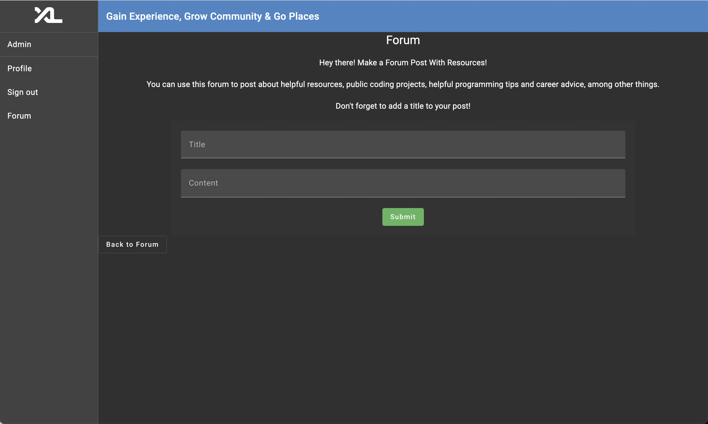
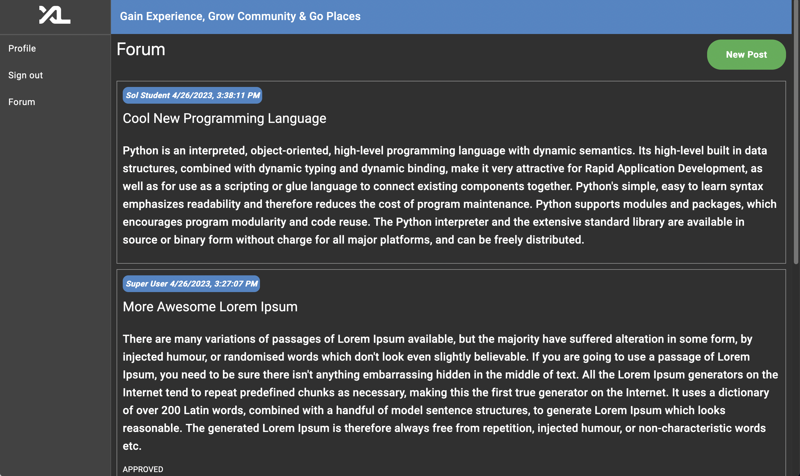
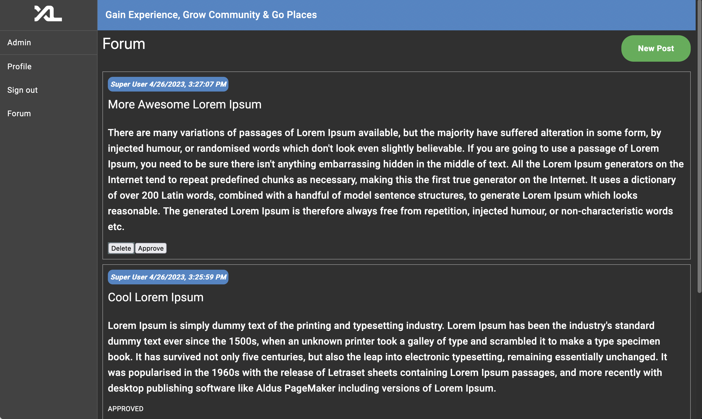
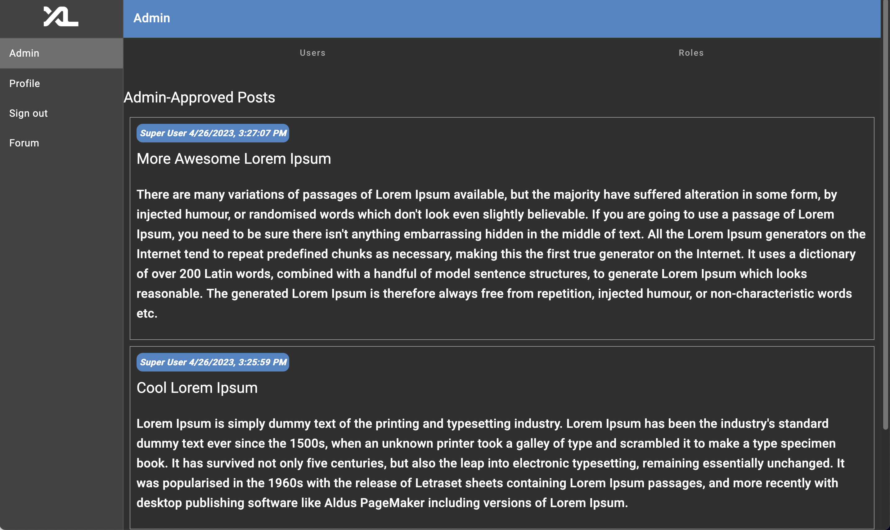

# CSXL Forum 
**✏️ Authors:**

William Astilla (technical lead): https://github.com/wastilla

Angelina Su: https://github.com/angelinasu57

Marten Warren Quadland: https://github.com/wquadland

Aayush Mehra: https://github.com/aayush110


## 🔍 Overview
The CSXL forum is a tool for students and faculty to share and promote resources about technology and computer science. Having this forum would faciliate increased communication in what resources were helpful for a certain class, how a student could prepare for a class they are planning to take next semester, or just in general curiousity about topics in computer science and technology.

## ✔️ Features available for Registered Users:
➕ **Post** resources and information to the forum



👀 **View** posts from other users

👀 **View** only a given number of posts on a single page (through in-built pagination)



✖️ **Delete** posts from forum (***Admin Users Only***)

✔️ **Give approval** to an existing post (***Admin Users Only***)



👀 **View** all approved posts in admin tab (***Admin Users Only***)




##  💻 Implementation notes

### Database Representation:
Post objects in our database contain the following fields:
* id - integer
* title - string
* content - string
* user - User Object
* votes - array of user objects
* timestamp - string

We represent all of these fields as mapped columns within the PostEntity. However, two columns represent special cases:
* The user column of PostEntity back populates the user field of the UserEntity table, allowing for users to access all of the posts that they have created
  * The goal of this implementation is to establish a one-to-many relationship between a post and a user
* The votes column of PostEntity populates a secondary table to establish a bi-directional relationship between users and posts


### Design Choices:

* **Admin-only post deletion**
  * Only admin users (Merritt Manager and Super User) may access a delete button when viewing the forum.
  * Delete button allows admin users to remove posts that may be insensitive, inappropriate, or against XL community guidelines. 

* **Admin-only post approval**
  * Only admin users (Merritt Manager and Super User) are able to approve posts via approve button.
  * Post approval draws attention to posts that admin found especially helpful/interesting. 

* **Forum Pagination**
  * Paginator that allows users to view only five posts on a page at a time. 
  * Limiting each page to five posts allowed users to browse the resources listed on the posts without feeling overwhelmed.
  * User is able to navigate through the pages through a "next" and "previous" button at the bottom of the webpage

## ✍️ How to Contribute 

Clone the repository below, which contains the basic code to make and view a post, and features to modify and delete those posts.

### 🐤 Getting Started

#### Clone the Repository
```
git clone https://github.com/comp423-23s/final-project-final-d5.git

```
Open your project locally, without opening it in a Dev Container at first, and follow the instructions to get started found in the project’s docs directory: docs/get_started.md

### ❗Important Backend Files:
* ***backend/api/post.py*** - contains all API routes for retrieving, deleting, and creating posts (documentation for each found in file)
* ***backend/services/post.py*** - contains all services called by API to mutate post database (creating post, deleting post, retrieving all posts)
*  ***backend/models/post.py*** - data model for posts
* ***backend/entities/post_entity.py*** - entity representation of Post in database

### ❗Important Frontend Files:
* ***frontend/src/app/post.service.ts*** - contains functions that make API calls, allowing the frontend to access and mutate database
* ***frontend/src/app/viewforum*** - component for viewing posts 
* ***frontend/src/app/makeforum*** - component for creating a new forum post
* ***frontend/src/app/pagination*** - component for pagination


### Tips for adding a new feature: 
* **Look through files** and trace through how a post is created and posted on the forum on both the frontend and backend. 
  * Most of the current features contain frontend and backend concerns. 
  * Understanding this process on both ends will give more clarity in how to implement new features/improve existing features, regardless of if your proposed changes effect the frontend or backend.

* **Determine how responsibilities are split in your team**, or if you are working solo, the tasks you will need to complete. 
  * Implementing a steady workflow requires choosing which tasks to prioritize and doing them on time: using the project board on GitHub is a good way of ensuring you are staying on track. 

* **Documentation on code, code commits, and GitHub** are excellent ways of tracking where you are on the implementation and what task to tackle next -- especially when it involves a lot of dynamic parts. 
  * Good documentation allows for future devs to understand what changes you made / how they might be able to improve upon said changes 

## 💭Future Work 

### New Feature Ideas:
* **User Post Deletion**:
  * Allow users to delete posts they _they_ created
  * Likely will be a similar implementation to admin-only delete
  * Display a delete button on a post only if the logged-in user is the creator of said post
* **Post Sorting**:
  * Add categories or tags to post entities, allowing users to sort posts by topic

* **Post Saving**:
  * Allow users to save posts that interest them
  * Saved posts can be viewed by user at a later point in time

* **Post Voting**:
  * Enable users to vote for posts that they found particularly helpful
  * Users can see # of votes each post has
  * Posts with many votes appear higher in search results
  * Indicate if a post has been votes for by an instructor/admin  
  * Entity/database representation for votes is already implemented, just need ot create api route, service, and integrate with frontend


## How We Addressed Sprint 2 Expectations :

### EXPECTATION 1: 
We have thoroughly kept our project board updated with issues that have a sufficient amount of description. Every issue on the board is also linked to a pull request. 

Every commit that is merged into stage in the form of a pull request has a detailed description. Every pull request also has one or multiple code reviews that have their own comments.

We have used as much Angular Material components as we could. These Angular UI components can especially be seen in issue #30 ("UI/UX Improvements) on our project board under the "Done" header. This issue is linked to three pull requests #42, #43, #44 which reflect the UI/UX changes to the textboxes, colors/themes and layout that we made using Angular UI components.

Issue #56 titled "56 - Updating docstrings to match google python style guide" in the "Done" header of our project board, reflects how we have met the project expectation: "Backend service classes should be tested using Pytest with mock data. Backend service classes and methods should be documented using docstrings following the Google Python Style Guide." 

We have also paid careful attention to which users have access to which functionalities. The personas of Merritt Manager and Super User are the only users with the admin side functionalities of deleting posts, approving posts, and viewing a list of posts that have been approved.
Stories that we have merged into stage are of usable, production quality that could actually be implemented into the XL website in the future!

### EXPECTATION 2:

We implemented Angular UI components, where applicable, to make our website more user friendly and intuitive. On our main viewforum page (https://team-d5-comp423-23s.apps.cloudapps.unc.edu/viewforum) we have added a green button for adding a new post to the forum. 

Each post is displayed in its own separate box where the name of the user is listed within the post as well as the date and time that they created the post. 

Each post also has a delete and approve button which are specific buttons that only admin personas can see. 

When users click on the green New Post button they are taken to a page with a user intuitive form where they can make a forum post with a title and content (https://team-d5-comp423-23s.apps.cloudapps.unc.edu/forum).

We have also implemented friendly error messages throughout the website. In the viewforum part of the website, when one of our admin users tries to delete a post, they see a confirmation pop-up asking if they actually want to delete the post or not. If an admin user clicks on the approve button, they get a pop-up message thanking them for approving. 

All users have the ability to post when they click the green New Post button. If users have an empty Title or Content field, then users see a friendly error message that says “Unable to Post empty content, please check your input!”. If users have both, empty content and an empty title, then they receive the error message: “Unable to post empty title and empty content, please check your input!”. The page to make a forum post also has other user intuitive buttons - a “Back to Forum” that takes one to the page where they can view all forums. We also have a Submit button that turns green when one clicks over it to submit their post.

In order to have clear user instructions and make the website as easy to use as it can be for our users, we have included a short description of what the forum is and how a user can use it to post helpful resources, public coding projects, helpful programming tips and career advice, among other things. ** >>someone from d5 needs to cr**. This description is on the top part of the page where users can create a new post (https://team-d5-comp423-23s.apps.cloudapps.unc.edu/forum).

Also another cool thing - every button and feature that you see on our website actually works! Users cannot see anything that does not work :)

### EXPECTATION 3:

We have integrated a full set of CRUDS (Create, Read, Update, Delete, and List or Search) functionality for administrators. Our admin users, namely Super User and Merritt Manager have the ability to make a new forum post (create functionality). They also have the ability to view posts made by themselves and others (read functionality). 

Admin users can also click on an approve button within a post to approve a post (update functionality). Then, in the admin tab they can view all the posts they have approved (list functionality). 

Admin users also have the ability to delete posts that may be inappropriate for the XL (delete functionality).


### EXPECTATION 4:
This file (which is essentially our main documentation file) is written in language that is meant for a developer to read. 

We have used emoticons and easy-to-understand headings as well as a combination of paragraphs and bullets to make our documentation as clear as possible. 

We have also used not one, but multiple screenshots in this file, to specificy the various functionalities of our website from either the end user or the administrator’s perspective. 
